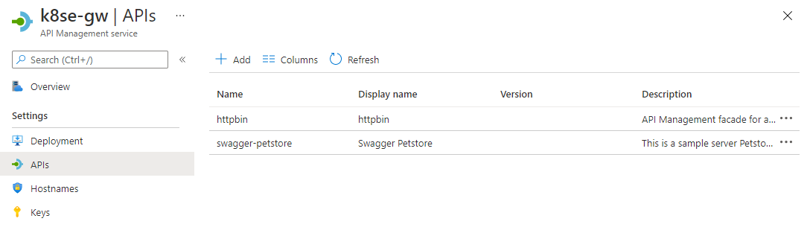

# Kubernetes Ingress and Cloud confguration in Self-Hosted Gateway

This is continuation from `Ingress Only` walkthrough where API Management Self-hosted gateway was deployed and configured to read Ingress rules in Kubernetes cluster. If you are starting clean, please execute following commands to get to the latest state:

```
kubectl create namespace gw
kubectl apply -f backend-echo.yml -n=gw
kubectl apply -f ingress-deployment.yml -n=gw
kubectl apply -f ingress.yml -n=gw
```

## Walkthrough
At this point Self-hosted gateway should be deployed and confgured according to Ingress Rules to expose `Echo` service. 
Next let's follow the article on how to [Deploy a self-hosted gateway to Kubernetes](https://docs.microsoft.com/en-us/azure/api-management/how-to-deploy-self-hosted-gateway-kubernetes). 
For this purpose `ingress-deployment.yml` is changed to include  `config.service.endpoint` and `config.service.auth` variables. The final state is saved to `ingress-deployment-cloud.yml`.
Before deploying please make sure to replace the appropriate values from API Management service in [portal.azure.com](portal.azure.com):
1.  `config.service.endpoint` - [line 14](ingress-deployment-cloud.yml#L14)
1. `config.service.auth` - [line 7](ingress-deployment-cloud.yml#L7)

`kubectl apply -f ingress-deployment-cloud.yml -n=gw`

### Testing HTTP calls
To test a runtime call, the APIs needs to be assigned to the gateway. 
the example below is using [Petstore APIs](https://petstore.swagger.io/) imported into API Management service and assinged to the self-hosted gateway. In Azure portal the configuration looks like this:



#### Get external IP address
Following command returns the external ip address to which we can test the call
```
> kubectl get service apim-ingress-service -n=gw4
NAME                   TYPE           CLUSTER-IP     EXTERNAL-IP    PORT(S)                      AGE
apim-ingress-service   LoadBalancer   10.0.100.231   40.125.75.211   80:31171/TCP,443:31959/TCP   27m
```

Now that we have everything configured, let's make an HTTP call. Using an external IP address `40.125.75.211` in the case above:
```
> curl http://40.125.75.211/pet/store/inventory
{"sold":8,"SOLD":1,"string":306,"pending":3,"available":663,"avalible":1}
```
 
### Troubleshooting
In case of difficulties, there are several things to check in the logs for the pod: 

#### Ensure k8s.ingress.enabled flag is set
Following excerpt from the logs would provide this clue
```
[Info] 2021-02-8T11:01:48.803 [ConfigIngressName], message: Starting gateway 5f56585f12db2b1b302ee653 in namespace gw4 and using prefix 4b26700a for all events to disambiguate K8 events., source: KubernetesConfigurationRepositoryProvider
[Warn] 2021-02-8T11:01:49.309 [LoadBackupLocationNotFound], message: /apim/config, source: FileBackupProvider
...
[Info] 2021-02-8T11:01:51.206 [ConfigStarted], source: CompositConfigurationRepositoryProvider
[Info] 2021-02-8T11:01:51.206 [ConfigStarted], message: Kubernetes Ingress is enabled. 'k8s.ingress.enabled':True, source: CompositConfigurationRepositoryProvider
[Info] 2021-02-8T11:01:51.303 [ConfigIngressStarted], source: KubernetesConfigurationRepositoryProvider
...
[Info] 2021-02-8T11:01:51.807 [ReadingCurrentIngressList], source: KubernetesConfigurationRepositoryProvider
[Info] 2021-02-8T11:01:53.107 [MatchingIngressFound], message: namespace: gw4, ingressClassName: azure-api-management/gateway, count: 1, resourceVersion: 147765571, source: KubernetesConfigurationRepositoryProvider
[Info] 2021-02-8T11:01:53.109 [IngressAdded], message: namespace: gw4, ingress.class: azure-api-management/gateway, name: ingress, resourceVersion: 147762114, source: KubernetesConfigurationRepositoryProvider
...
[Info] 2021-02-8T11:01:58.709 [IngressSuccessfullyProcessed], source: KubernetesConfigurationRepositoryProvider
[Info] 2021-02-8T11:01:58.709 [CurrentIngressListProcessed], message: 147765571, source: KubernetesConfigurationRepositoryProvider
[Info] 2021-02-8T11:01:58.907 [IngressWatcherInitialized], message: 147765571, source: KubernetesConfigurationRepositoryProvider
```

#### Ensure 
Following traces show cloud configuration
```

[Info] 2021-02-8T11:01:59.007 [ConfigStarted], message: Connected service is enabled. 'config.service.endpoint' is set., source: CompositConfigurationRepositoryProvider
[Info] 2021-02-8T11:01:59.109 [ConfigInitialSyncStarted], source: ConfigurationRepositoryProvider
[Info] 2021-02-8T11:02:02.405 [EventSnapshotElected], message: provider: storage, uri: https://[redacted].blob.core.windows.net/[redacted]/snapshot-2019-10-11.Proxy.Host.WebRole_IN_0.json.gzip, rev: 610, source: events.snapshot
[Info] 2021-02-8T11:02:02.409 [ConfigurationRetrieving], message: https://[redacted].blob.core.windows.net/[redacted]/snapshot-2019-10-11.Proxy.Host.WebRole_IN_0.json.gzip, source: events.snapshot.storage.private
[Info] 2021-02-8T11:02:02.810 [ConfigurationLoaded], message: https://[redacted].blob.core.windows.net/[redacted]/snapshot-2019-10-11.Proxy.Host.WebRole_IN_0.json.gzip, source: events.snapshot.storage.private
[Info] 2021-02-8T11:02:05.603 [ConfigurationRetrieved], message: https://[redacted].blob.core.windows.net/[redacted]/snapshot-2019-10-11.Proxy.Host.WebRole_IN_0.json.gzip, source: events.snapshot.storage.private
[Info] 2021-02-8T11:02:07.111 [OperationRouteTableRebuildStarted], message: echo-api;rev=1, source: ApiRouter
[Info] 2021-02-8T11:02:07.411 [OperationRouteTableRebuildCompleted], message: echo-api;rev=1, source: ApiRouter
[Info] 2021-02-8T11:02:07.411 [OperationRouteTableRebuildStarted], message: swagger-petstore;rev=1, source: ApiRouter
[Info] 2021-02-8T11:02:07.507 [OperationRouteTableRebuildCompleted], message: swagger-petstore;rev=1, source: ApiRouter
[Info] 2021-02-8T11:02:07.508 [OperationRouteTableRebuildStarted], message: httpbin;rev=1, source: ApiRouter
[Info] 2021-02-8T11:02:07.508 [OperationRouteTableRebuildCompleted], message: httpbin;rev=1, source: ApiRouter
[Info] 2021-02-8T11:02:07.810 [ManagedIdentityAddedToMap], message: systemAssigned, source: ManagedIdentityResolver
...
[Info] 2021-02-8T11:02:10.305 [BootstrapperStarted], source: Bootstrapper
[Info] 2021-02-8T11:02:10.307 [TenantStarted], message: 6021c2d47edd480001aed27e 00:00:29.9972171
```

